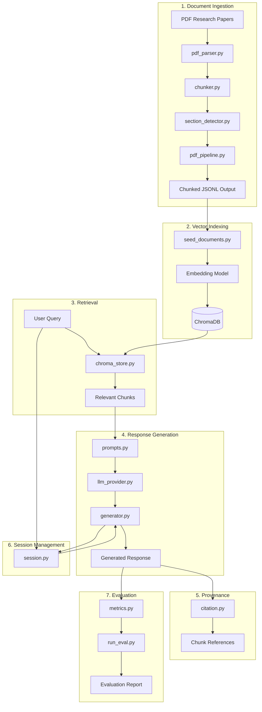

# SARAL Chatbot — Architecture

## System Overview

The application is a Retrieval-Augmented Generation (RAG) chatbot built around a collection of research papers. Documents are parsed, chunked, embedded, stored in ChromaDB, retrieved at query time, and used to generate grounded responses with source provenance.

## Pipeline Diagram



---

# Module Map

| Layer        | Module                              | Responsibility                                  |
| ------------ | ----------------------------------- | ----------------------------------------------- |
| Chat         | `app/chat/cli.py`                   | Command-line chatbot interface                  |
| Conversation | `app/conversation/session.py`       | Maintains conversation state and history        |
| Ingestion    | `app/ingestion/pdf_parser.py`       | Extracts text from PDF documents                |
| Ingestion    | `app/ingestion/chunker.py`          | Splits documents into retrieval-friendly chunks |
| Ingestion    | `app/ingestion/section_detector.py` | Identifies document sections and metadata       |
| Ingestion    | `app/ingestion/pdf_pipeline.py`     | End-to-end ingestion workflow                   |
| Ingestion    | `app/ingestion/seed_documents.py`   | Loads processed chunks into the vector store    |
| Vector Store | `app/vector_store/chroma_store.py`  | ChromaDB integration and retrieval logic        |
| Generation   | `app/generation/prompts.py`         | Prompt construction templates                   |
| Generation   | `app/generation/llm_provider.py`    | LLM abstraction layer                           |
| Generation   | `app/generation/generator.py`       | Retrieval and generation orchestration          |
| Provenance   | `app/provenance/citation.py`        | Citation extraction and source mapping          |
| Evaluation   | `app/evaluation/metrics.py`         | Evaluation metrics implementation               |
| Evaluation   | `app/evaluation/run_eval.py`        | Automated evaluation pipeline                   |

---

# Retrieval Flow

1. User submits a question through the CLI.
2. The query is sent to the Chroma retriever.
3. Relevant chunks are fetched from the vector store.
4. Retrieved context is injected into a prompt template.
5. The selected LLM generates a response.
6. Citation information is attached to the output.
7. Conversation history is stored for subsequent turns.

---

# Design Decisions

## ChromaDB for Retrieval

ChromaDB provides lightweight local vector storage with efficient similarity search. This keeps the system easy to run and suitable for a take-home assignment without requiring external infrastructure.

## Modular LLM Layer

`llm_provider.py` separates model access from business logic. New providers can be added without modifying retrieval or conversation code.

## Persistent Conversation State

Session management is isolated in `session.py`, allowing follow-up questions to retain context across turns.

## Source-Aware Responses

The provenance layer links generated answers back to retrieved document chunks, improving transparency and supporting evaluation.

## Offline Evaluation

The evaluation package allows retrieval and answer quality to be measured independently of the interactive chat workflow.

---

# Data Storage

```text
raw_pdfs/
├── research papers

app/ingestion/output/
├── processed JSONL chunks

app/db/research_papers/
├── chroma.sqlite3
└── vector index files
```